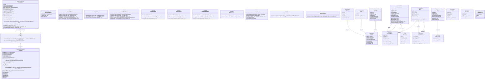

# Enumeration Model Diagram

```mermaid
classDiagram
class Coordinator {
    <<Interface>>
    +EnumerateTarget(ctx context.Context, target config.TargetSpec, auth map[string]config.AuthConfig) EnumerationResult
    +ResumeTarget(ctx context.Context, state *domain.SessionState) EnumerationResult
}
class coordinator {
    <<Service Implementation>>
    -scanTargetRepo ScanTargetRepository
    -githubTargetRepo GithubRepository
    -urlTargetRepo URLRepository
    -batchRepo BatchRepository
    -stateRepo StateRepository
    -checkpointRepo CheckpointRepository
    -taskRepo TaskRepository
    -enumeratorHandlers map[shared.TargetType]enumeration.ResourcePersister
    -enumFactory EnumeratorFactory
    -credStore credentials.Store
    -logger.Logger logger
    -metrics metrics
    -trace.Tracer tracer
    +EnumerateTarget(ctx, target config.TargetSpec, auth map[string]config.AuthConfig) EnumerationResult
    +ResumeTarget(ctx, state *domain.SessionState) EnumerationResult
    -processTargetEnumeration(...)
    -streamEnumerate(...)
    -processBatch(...)
    -processTarget(...)
    -createScanTarget(...)
    -failEnumeration(...)
    -startSpan(...)
}
Coordinator <|-- coordinator : "implements"
class Orchestrator {
    <<Application Service>>
    -id string
    -coordinator cluster.Coordinator
    -workQueue events.EventBus
    -eventPublisher events.DomainEventPublisher
    -cfgLoader loaders.Loader
    -enumerationService Coordinator
    -rulesService rulessvc.Service
    -jobRepo scanning.JobRepository
    -stateRepo StateRepository
    -progressTracker scan.ProgressTracker
    -progressHandlers map[events.EventType]func(ctx context.Context, evt events.EventEnvelope) error
    -logger.Logger logger
    -metrics OrchestrationMetrics
    -tracer trace.Tracer
    -processedRules map[string]time.Time
    -rulesMutex sync.RWMutex
    +Run(ctx context.Context) (<-chan struct, error)
    +Enumerate(ctx context.Context) error
    +resumeEnumerations(ctx context.Context, states []*SessionState) error
    +createJob(ctx context.Context, job *scanning.Job) error
    ...
}
Orchestrator --> Coordinator : "uses enumerationService"
class EnumerationResult {
    <<Data Object>>
    -ScanTargetCh <-chan []uuid.UUID
    -TaskCh       <-chan *Task
    -ErrCh        <-chan error
}
class GithubRepository {
    <<Interface>>
    +Create(ctx context.Context, repo *GitHubRepo) (int64, error)
    +Update(ctx context.Context, repo *GitHubRepo) error
    +GetByID(ctx context.Context, id int64) (*GitHubRepo, error)
    +GetByURL(ctx context.Context, url string) (*GitHubRepo, error)
    +List(ctx context.Context, limit, offset int32) ([]*GitHubRepo, error)
}
class URLRepository {
    <<Interface>>
    +Create(ctx context.Context, target *URLTarget) (int64, error)
    +GetByURL(ctx context.Context, url string) (*URLTarget, error)
    +Update(ctx context.Context, target *URLTarget) error
}
class ScanTargetRepository {
    <<Interface>>
    +Create(ctx context.Context, target *ScanTarget) (uuid.UUID, error)
    +Update(ctx context.Context, target *ScanTarget) error
    +GetByID(ctx context.Context, id uuid.UUID) (*ScanTarget, error)
    +Find(ctx context.Context, targetType string, targetID int64) (*ScanTarget, error)
    +List(ctx context.Context, limit, offset int32) ([]*ScanTarget, error)
}
class BatchRepository {
    <<Interface>>
    +Save(ctx, batch *Batch) error
    +FindBySessionID(ctx, sessionID uuid.UUID) ([]*Batch, error)
    +FindLastBySessionID(ctx, sessionID uuid.UUID) (*Batch, error)
    +FindByID(ctx, batchID uuid.UUID) (*Batch, error)
}
class StateRepository {
    <<Interface>>
    +Save(ctx, state *SessionState) error
    +Load(ctx, sessionID uuid.UUID) (*SessionState, error)
    +GetActiveStates(ctx context.Context) ([]*SessionState, error)
    +List(ctx context.Context, limit int) ([]*SessionState, error)
}
class CheckpointRepository {
    <<Interface>>
    +Save(ctx context.Context, checkpoint *Checkpoint) error
    +Load(ctx context.Context, targetID uuid.UUID) (*Checkpoint, error)
    +LoadByID(ctx context.Context, id int64) (*Checkpoint, error)
    +Delete(ctx context.Context, targetID uuid.UUID) error
}
class TaskRepository {
    <<Interface>>
    +Save(ctx context.Context, task *Task) error
    +GetByID(ctx context.Context, taskID uuid.UUID) (*Task, error)
}
class metrics {
    <<Interface>>
    +ObserveTargetProcessingTime(ctx, duration time.Duration)
    +IncTargetsProcessed(ctx context.Context)
    +TrackEnumeration(ctx context.Context, fn func() error) error
    +IncTasksEnqueued(ctx)
    +IncTasksFailedToEnqueue(ctx)
}
class EnumeratorFactory {
    <<Interface>>
    +CreateEnumerator(target config.TargetSpec, creds *TaskCredentials) (TargetEnumerator, error)
}
class TargetEnumerator {
    <<Interface>>
    +Enumerate(ctx context.Context, startCursor *string, batchCh chan<- EnumerateBatch) error
}
class GitHubRepo {
    <<AggregateRoot>>
    -id int64
    -name string
    -url string
    -isActive bool
    -metadata map[string]any
    -timeline Timeline
}
class URLTarget {
    <<AggregateRoot>>
    -id int64
    -url string
    -metadata map[string]any
    -timeline Timeline
}
class ScanTarget {
    <<AggregateRoot>>
    -id uuid.UUID
    -name string
    -targetType string
    -targetID int64
    -metadata map[string]any
    -lastScanTime time.Time
    -timeline Timeline
}
class SessionState {
    <<AggregateRoot>>
    -string sessionID
    -string sourceType
    -Status status
    -string failureReason
    -Checkpoint lastCheckpoint
    -Timeline timeline
    -SessionMetrics metrics
    -json.RawMessage config
    +MarkInProgress() error
    +MarkCompleted() error
    +MarkFailed(reason string) error
    +ProcessCompletedBatch(batch *Batch) error
    +IsStalled(threshold time.Duration) bool
}
class Batch {
    <<AggregateRoot>>
    -string batchID
    -string sessionID
    -BatchStatus status
    -Checkpoint checkpoint
    -Timeline timeline
    -BatchMetrics metrics
    +MarkSuccessful(itemsProcessed int) error
    +MarkFailed(err error) error
}
class Task {
    <<AggregateRoot>>
    -string TaskID
    -string sessionID
    -string resourceURI
    -map~string,string~ metadata
    -TaskCredentials credentials
    +SessionID() string
    +ResourceURI() string
}
class Checkpoint {
    <<Entity>>
    -int64 id
    -uuid.UUID targetID
    -map~string,any~ data
    -time.Time updatedAt
    +IsTemporary() bool
    +SetID(id int64)
}
class Timeline {
    <<ValueObject>>
    -time.Time startedAt
    -time.Time completedAt
    -time.Time lastUpdate
    -TimeProvider timeProvider
    +MarkCompleted()
    +UpdateLastUpdate()
    +IsCompleted() bool
}
class SessionMetrics {
    <<ValueObject>>
    -int totalBatches
    -int failedBatches
    -int itemsFound
    -int itemsProcessed
    +IncrementTotalBatches()
    +IncrementFailedBatches()
    +AddProcessedItems(count int) error
    +HasFailedBatches() bool
}
class BatchMetrics {
    <<ValueObject>>
    -int expectedItems
    -int itemsProcessed
    -string errorDetails
    +MarkSuccessful(itemsProcessed int) error
    +MarkFailed(err error)
    +CompletionPercentage() float64
}
class TaskCredentials {
    <<ValueObject>>
    -CredentialType Type
    -map~string,any~ Values
}
class Status {
    <<Enumeration>>
    +INITIALIZED
    +IN_PROGRESS
    +COMPLETED
    +FAILED
    +STALLED
    +PARTIALLY_COMPLETED
}
class BatchStatus {
    <<Enumeration>>
    +IN_PROGRESS
    +SUCCEEDED
    +FAILED
    +PARTIALLY_COMPLETED
}
class CredentialType {
    <<Enumeration>>
    +Unauthenticated
    +GitHub
    +S3
}
GitHubRepo "1" --o "1" Timeline : "lifecycle"
URLTarget "1" --o "1" Timeline : "lifecycle"
ScanTarget "1" --o "1" Timeline : "lifecycle"
SessionState "1" --o "1" SessionMetrics : "metrics"
SessionState "1" --o "1" Timeline : "timeline"
SessionState "1" --o "0..1" Checkpoint : "lastCheckpoint"
Batch "1" --o "1" Timeline : "timeline"
Batch "1" --o "1" BatchMetrics : "metrics"
Batch "1" --o "0..1" Checkpoint : "checkpoint"
Task "1" --o "1" TaskCredentials : "credentials"
```
