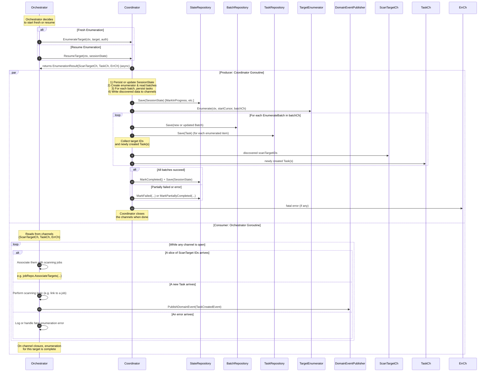

# Enumeration Sequence Diagram

```mermaid
sequenceDiagram
    autonumber

    participant ORCH as Orchestrator
    participant COORD as Coordinator
    participant SREP as StateRepository
    participant BREP as BatchRepository
    participant TREP as TaskRepository
    participant TENUM as TargetEnumerator
    participant EVPB as DomainEventPublisher

    note over ORCH: Orchestrator decides<br/>to start fresh or resume
    alt Fresh Enumeration
        ORCH->>COORD: EnumerateTarget(ctx, target, auth)
    else Resume Enumeration
        ORCH->>COORD: ResumeTarget(ctx, sessionState)
    end
    COORD-->>ORCH: returns EnumerationResult{ScanTargetCh, TaskCh, ErrCh} (async)

    par Producer: Coordinator Goroutine
        note over COORD: 1) Persist or update SessionState<br/>2) Create enumerator & read batches<br/>3) For each batch, persist tasks<br/>4) Write discovered data to channels
        COORD->>SREP: Save(SessionState) [MarkInProgress, etc.]
        COORD->>TENUM: Enumerate(ctx, startCursor, batchCh)

        loop For each EnumerateBatch in batchCh
            COORD->>BREP: Save(new or updated Batch)
            COORD->>TREP: Save(Task) (for each enumerated item)
            note over COORD: Collect target IDs<br/>and newly created Task(s)
            COORD->>ScanTargetCh: discovered scanTargetIDs
            COORD->>TaskCh: newly created Task(s)
        end

        alt All batches succeed
            COORD->>SREP: MarkCompleted() + Save(SessionState)
        else Partially failed or error
            COORD->>SREP: MarkFailed(...) or MarkPartiallyCompleted(...)
        end

        COORD->>ErrCh: fatal error (if any)
        note over COORD: Coordinator closes<br/>the channels when done
    and Consumer: Orchestrator Goroutine
        note over ORCH: Reads from channels<br/>(ScanTargetCh, TaskCh, ErrCh)
        loop While any channel is open
            alt A slice of ScanTarget IDs arrives
                ORCH->>ORCH: Associate them with scanning jobs
                note over ORCH: e.g. jobRepo.AssociateTargets(...)
            else A new Task arrives
                ORCH->>ORCH: Perform scanning logic (e.g. link to a job)
                ORCH->>EVPB: PublishDomainEvent(TaskCreatedEvent)
            else An error arrives
                ORCH->>ORCH: Log or handle fatal enumeration error
            end
        end
        note over ORCH: On channel closure, enumeration<br/>for this target is complete
    end
```
