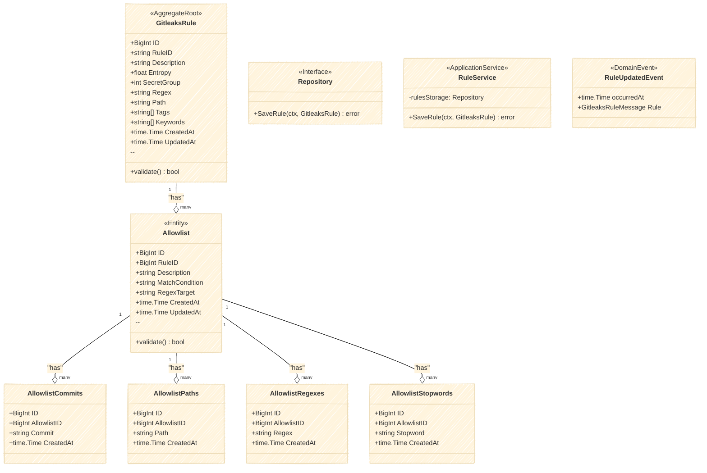

# Rules Model Diagram

```mermaid
---
config:
  theme: base
  look: handDrawn
---
classDiagram
    class GitleaksRule {
        <<AggregateRoot>>
        +BigInt ID
        +string RuleID
        +string Description
        +float Entropy
        +int SecretGroup
        +string Regex
        +string Path
        +string[] Tags
        +string[] Keywords
        +time.Time CreatedAt
        +time.Time UpdatedAt
        --
        +validate() bool
    }
    class Allowlist {
        <<Entity>>
        +BigInt ID
        +BigInt RuleID
        +string Description
        +string MatchCondition
        +string RegexTarget
        +time.Time CreatedAt
        +time.Time UpdatedAt
        --
        +validate() bool
    }
    class AllowlistCommits {
        +BigInt ID
        +BigInt AllowlistID
        +string Commit
        +time.Time CreatedAt
    }
    class AllowlistPaths {
        +BigInt ID
        +BigInt AllowlistID
        +string Path
        +time.Time CreatedAt
    }
    class AllowlistRegexes {
        +BigInt ID
        +BigInt AllowlistID
        +string Regex
        +time.Time CreatedAt
    }
    class AllowlistStopwords {
        +BigInt ID
        +BigInt AllowlistID
        +string Stopword
        +time.Time CreatedAt
    }
    GitleaksRule "1" --o "many" Allowlist : "has"
    Allowlist "1" --o "many" AllowlistCommits : "has"
    Allowlist "1" --o "many" AllowlistPaths : "has"
    Allowlist "1" --o "many" AllowlistRegexes : "has"
    Allowlist "1" --o "many" AllowlistStopwords : "has"
    class Repository {
        <<Interface>>
        +SaveRule(ctx, GitleaksRule) error
    }
    class RuleService {
        <<ApplicationService>>
        +SaveRule(ctx, GitleaksRule) error
        -rulesStorage: Repository
    }
    class RuleUpdatedEvent {
        <<DomainEvent>>
        +time.Time occurredAt
        +GitleaksRuleMessage Rule
    }
```
