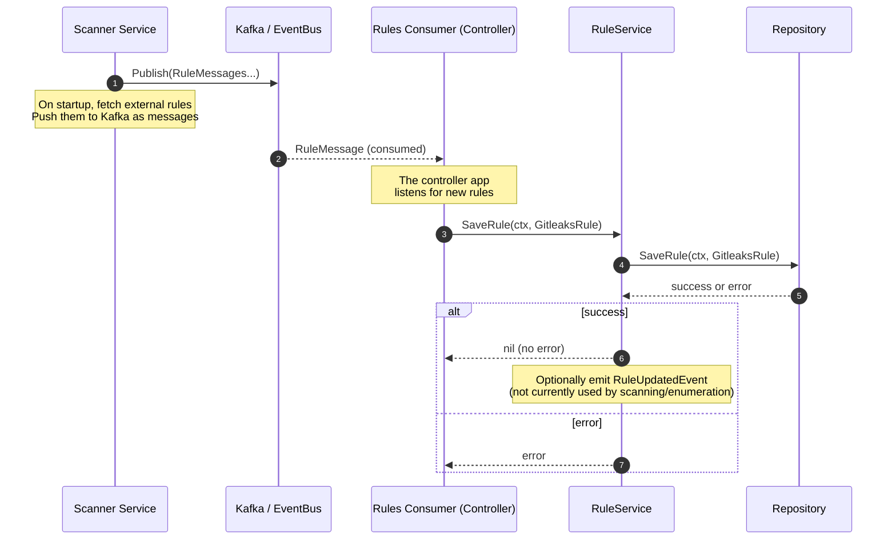

# Rules Sequence Diagram

```mermaid
sequenceDiagram
    autonumber
    participant SCN as Scanner Service
    participant KAFKA as Kafka / EventBus
    participant CON as Rules Consumer (Controller)
    participant RS as RuleService
    participant REPO as Repository
    SCN->>KAFKA: Publish(RuleMessages...)
    Note over SCN: On startup, fetch external rules<br>Push them to Kafka as messages
    KAFKA-->>CON: RuleMessage (consumed)
    Note over CON: The controller app<br>listens for new rules
    CON->>RS: SaveRule(ctx, GitleaksRule)
    RS->>REPO: SaveRule(ctx, GitleaksRule)
    REPO-->>RS: success or error
    alt success
        RS-->>CON: nil (no error)
        Note over RS: Optionally emit RuleUpdatedEvent<br>(not currently used by scanning/enumeration)
    else error
        RS-->>CON: error
    end
```
